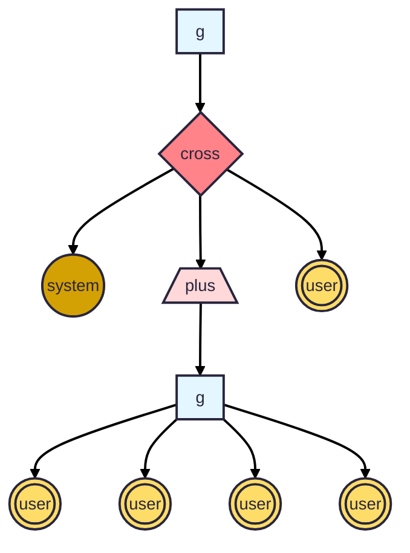

# SPNL: A Declarative Query Language for LLMs

:rocket: [SPNL Playground](https://pages.github.ibm.com/cloud-computer/spnl/?qv=false)

SPNL provides a declarative query foundation for writing scalable
interactions with large language models (LLMs).  A **SPNL query**
allows messages to be arranged into a map/reduce-style tree of
generation calls. When LLM calls are arranged in this way, they can be
*planned* so as to a) improve the quality of generated output; b)
increase cache locality on the model server.

A SPNL query can be considered as an abstract syntax tree (AST) where
each leaf node is a "message" and each interior node is one of three
core operators `g`, `cross`, and `plus`.

- Each `g` sends messages to a model for generation.
- Each `plus` indicates that the given arguments are independent; think of this as a
data-parallel map, with the additional property that models can
interpret the arguments in such a way as not to have the given tokens
co-attend. 
- Each `cross` indicates that the given arguments are dependent; think
of this as a data-parallel reduce, where models must have the given
tokens attend to eachother. As with a data-parallel reduce, `cross`
has two sub-variants depending on whether or not the reduce is
*commutative*.
- Leaf nodes are either system or user messages. Below we may shorten
  these to `s` and `u`.



## Quick Overview of this Repository

This repository consists of Rust workspaces that implement
- **spnl**: The core Span Language support, including a `spnl!` Rust macro that produces a runnable query, and `run::run` which can then be used to execute the query.
- **spnl_cli**: A demonstration CLI that includes a handful of demo queries.
- **spnl_wasm**: Wraps `spnl` into a WASM build.
- **spnl_web**: A simple web UI that runs queries directly in a browser via [WebLLM](https://github.com/mlc-ai/web-llm).

## Prototype DSL for SPNL

To explore this space, we use a simple LISP-like DSL:

- `(g model input)`: Used to ask a model to generate new output.
- `(plus d1 d2 ...)`: Used to signify that the given items `d1`, `d2`,
  ... are to be considered independent of eachother.
- `(cross d1 d2 ...)`: Ibid, except now the items are to be considered
  as having a linear dependence on eachother.

### Helpers: ask, file, repeat, format
In addition to these three core operators, the DSL offers some helpful
syntactic sugarings. These include `(ask message)` which prompts the
user for a message, `(file filepath)` which reads in a string from the
given local file path, and `(repeat n <subquery>)` which expands the
given subquery `n` times.

### Examples:

This will generate (`g`) some output, using the given "model server/model", provided with the given input "Hello world":
```lisp
(g "ollama/granite3.2:2b" "Hello world")
```

Same, except ask the user (or read from a file) which prompt should be send to the generation.
```lisp
(g "ollama/granite3.2:2b" (read "What should I ask the model?"))
(g "ollama/granite3.2:2b" (file "./prompt.txt"))
```

Send a sequence of prompts to the model:
```lisp
(g "ollama/granite3.2:2b" (cross (read "What should I ask the model?")  (file "./prompt.txt")))
```

The `g` operator also accepts optional max tokens and temperature
options. Here analyze three independent inputs, each generated with
max tokens of 1000 and a temperature of 0.3:
```lisp
(g "ollama/granite3.2:2b"
   (cross "Pick the best one"
          (plus (g "ollama/granite3.2:2b" "Generate a fun email" 1000 0.3)
                (g "ollama/granite3.2:2b" "Generate a fun email" 1000 0.3)
                (g "ollama/granite3.2:2b" "Generate a fun email" 1000 0.3))))
```
