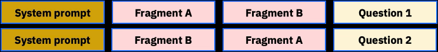

# ABBA Microbenchmark


This microbenchmark helps to identify the potential of [block
attention](https://arxiv.org/pdf/2409), in which the blocks of a
[paged attention](https://arxiv.org/abs/2309.06180) model serving
architecture can be identified as *relocatable* blocks. The KV cache
entries of such blocks can still be used, even if used in a sequence
order that is different than originally seen. We expect either of the
following to exhibit the same cache locality, independent of the order
of presentation of the document fragments.



To send a query, first prepare the query shape:

```bash
curl -s -XPOST http://localhost:8000/v1/query/prepare --data @./query-ab.json -o /dev/null -w "%{time_total}\n"
1.504452
```

And then you can execute the query in either order, and you should see millisecond-level TTFT:

```bash
curl -s -XPOST http://localhost:8000/v1/query/execute --data @./query-ba.json -o /dev/null -w "%{time_total}\n"
0.077699
```

```bash
curl -s -XPOST http://localhost:8000/v1/query/execute --data @./query-ab.json -o /dev/null -w "%{time_total}\n"
0.078419
```
