# Concretely Speaking, What is a Span Query?

> [!TIP]
> Consult [this page](feature-flags.md) for a summary of the feature
> flags you can use to selectively enable more complex features.

A span query can be considered as an abstract syntax tree (AST) where
each leaf node is a message (i.e. some kind of content to be sent to
the model) and each interior node is either a `g` (indicating that new
content should be generated) or a *data dependence* operator (`x` or
`+`) that describe how the messages depend on eachother.

- Each `g` sends messages to a model for generation.
- Each `+` ("plus") indicates that the given arguments are
independent; think of this as a data-parallel map, with the additional
property that models can interpret the arguments in such a way as not
to have the given tokens co-attend.
- Each `x` ("cross") indicates that the given arguments are dependent;
think of this as a data-parallel reduce, where models must have the
given tokens attend to eachother. As with a data-parallel reduce,
`cross` has two sub-variants depending on whether or not the reduce is
*commutative*.
- Leaf nodes are either system or user messages. Below we may shorten
  these to `s` and `u`.

```mermaid
flowchart TD
        g1((g)) --> x1((x))
        x1 --> s1((s))
        x1 --> p1((＋))
        x1 --> u1((u))
        p1 --> g2((g))
        p1 --> g3((g))
        p1 --> g4((g))
        p1 --> g5((g))
        g2 --> u2((u))
        g3 --> u3((u))
        g4 --> u4((u))
        g5 --> u5((u))

        classDef g fill:#e4f6ff
        classDef x fill:#ff8389
        classDef p fill:#ffd8d9
        classDef s fill:#d4a104
        classDef u fill:#fddc68
        class g1,g2,g3,g4,g5 g
        class x1 x
        class p1 p
        class s1 s
        class u1,u2,u3,u4,u5 u
```



The Rust code is capable of deserializing a JSON structure that models
these core concepts (g, cross, plus). Below we show some
[examples](#examples) of the current JSON syntax. We have made the
conscious choice in favor of fast server-side parsing, through the use
of what is known in the Rust world as [externally tagged
enums](https://serde.rs/enum-representations.html#externally-tagged).

## Data Operations

To help with assembling messages from storage subsystems, a span query
may pull data from either stdin or a filesystem. These are not yet
feature flagged, but that should happen soon. The key operations here are:

- `read filepath`: which takes a file path and returns the contents of
  that file.
- `take N`: which assumes the given content is a set of line-based
  records, and extracts the first `N` such records.

## Sugaring Utilities

Finally, there are a set of syntactic sugars that can help with
constructing concise prompts. These also are not yet feature flagged,
but should be soon.

- `repeat N body`: which repeats the given `body` `N` times. Helpful
  in judge/generator patterns, to generate a fixed number of replicas
  of a base generate pattern.

## Debugging Utilities

- `ask prompt`: takes a prompt to be displayed on the local terminal,
  and returns the message the user typed in response.
- `print message`: for debugging, will print the given message to the
  console.

## Examples:

This will generate (`g`) some output, using the given model, provided
with the given input of a user message "Hello world":
```json
{
  "g": {
    "model": "ollama/granite3.2:2b",
    "input": [
      {
        "user": "Hello world"
      }
    ]
  }
}
```

Send a sequence of prompts to the model:
```json
{
  "g": {
    "model": "ollama/granite3.2:2b",
    "input": {
      "cross": [
        {
          "ask": "What should I ask the model?"
        },
        {
          "file": "./prompt.txt"
        }
      ]
    }
  }
}
```

The `g` operator also accepts optional max tokens and temperature
options. Here analyze three independent inputs, each generated with
max tokens of 1000 and a temperature of 0.3:
```json
{
  "g": {
    "model": "ollama/granite3.2:2b",
    "input": {
      "cross": [
        {
          "system": "You judge emails by scoring them"
        },
        {
          "plus": [
            {
              "repeat": {
                "n": 4,
                "query": {
                  "g": {
                    "model": "ollama/granite3.2:2b",
                    "input": {
                      "user": "Generate a fun email"
                    },
                    "max_tokens": 1000,
                    "temperature": 0.3
                  }
                }
              }
            }
          ]
        },
        {
          "user": "I am looking for a job at NASA"
        }
      ]
    }
  }
}
```
